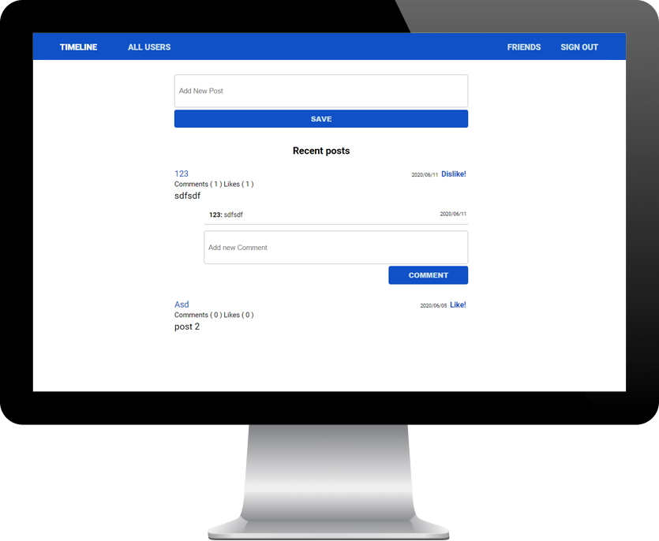
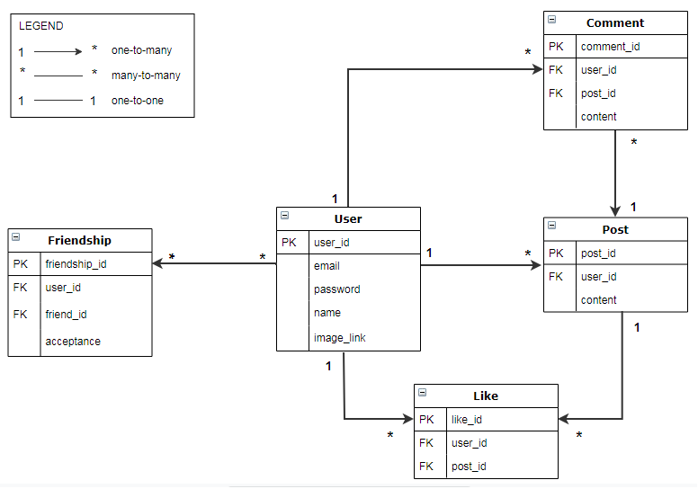

# Stay in touch
> A social media app where you can have friends, make posts, comment and drop likes.



<br>The main point on this project is to practice industry standards to implement new features on existing applications.<br>

## Online Version
[Live Demo Link](https://evening-ravine-92144.herokuapp.com/users/sign_in)

## Content

* [Features](#features)
* [Built With](#built-with)
* [Database Diagram](#database-diagram)
* [Getting Start](#getting-start)
* [Contributing](#contributing)
* [Acknowledgments](#acknowledgments)
* [Author](#author)
* [License](#license)

## Features

<ul>
  <p>As a guest your can: </p>
  <li>Create account and make login</li>
  <li>Display properly content</li>
</ul>

<ul>
  <p>As a logged-in user: </p>
  <li>See other people profiles with they posts</li>
  
  <li>Send friendship invitations</li>
  <li>See pending friendships and accept/reject</li>
  
  <li>Create posts and leave comments</li>  
  <li>leave like/dislike once at any post</li>
  
  <li>Have a timeline with all friends posts</li>
</ul>

## Built With

- Ruby 2.7 <br>
- Ruby on Rails 5.2 <br>
- Postgres and Devise gem (AOT)
- Rubocop (Linter) with Stickler (CI Tool) <br>
- Git, Github and VScode <br>

## Database Diagram



## Getting Start

#### Install
To use this program, you will need install:
* Ruby Language - Version 2.5 up to 2.7 - [Install guide](https://www.ruby-lang.org/en/documentation/installation/)

* Ruby on Rails - Version 5.2 - [Install guide](https://guides.rubyonrails.org/v5.0/getting_started.html#installing-rails)


#### Get a local copy
Now you need a copy of this application, if you are using Git:
```js
git clone git@github.com:SevlaMare/ror-social-scaffold.git
```
Otherwise just hit (Download Zip) on green button (Clone or Download) at top of this page.


#### Setup

Instal all dependencies with:

```
bundle install
```

Setup database with:

```
rake db:schema:load
```

#### Run App
To run, from the application folder, just type on terminal:
```js
rails server
```
Now you can go to your favorite web browser like Google Crome and access the url
<br> http://localhost:3000


#### Test (Remove before merge!)
On terminal type:
```
rake db:test:load
```
It will create database for testing, to run the tests:
```
rspec
```

### Contributing

Contributions, issues and feature requests are welcome!

You can do it on [issues page](issues/).

## Acknowledgments

A special thanks for the code reviewers.

## Author

👤 **Rafael Nazario**

- Github: [@rsnazario](https://github.com/rsnazario)
- Twitter: [@rsnazario](https://twitter.com/rsnazario)
- Linkedin: [Rafael Nazario](https://www.linkedin.com/in/rafael-nazario-692b8293/)

👤 **Thiago Miranda**

- Github: [@SevlaMare](https://github.com/SevlaMare)
- Twitter: [#SevlaMare](https://twitter.com/SevlaMare)
- Linkedin: [SevlaMare](https://www.linkedin.com/in/sevla-mare)

### License

<strong>Creative Commons • June 2020</strong>
